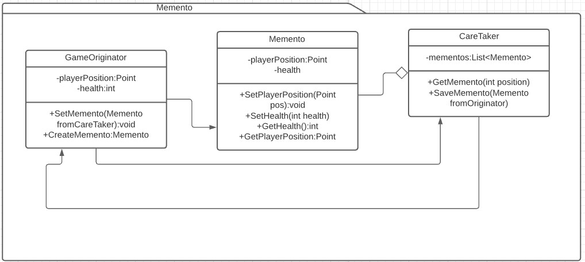

# Memento
Es un patrón de comportamiento. [Link descripción](https://sourcemaking.com/design_patterns/memento)

El patrón memento se utiliza para poder retroceder un objeto a un estado anterior mediante el uso de un originator, caretaker y objetos memento.

## Diagrama de clases

## SOLID

* Single responsibility
 
Cada uno de los objetos relacionados al patrón tiene un rol muy definido.

* Open/Closed principle

Es dificil extender la funcionalidad del Originator en una subclase sin extender la estructura interna del memento (o extender en otro memento), incluso así queda raro el manejo de mementos por el caretaker que no sabría distinguir entre ellos ya que un memento puede no tener la estructura de estados necesarias para volver al estado anterior de un originator. Creo que este principio se rompe con el patrón.

* Liskov Substitution

Aunque extendamos la funcionalidad de los mementos, estos están altamente cohesionados al originator y el caretaker no debería mezclar mementos distintos ya que la estructura de estados puede cambiar. Entiendo que este principio tampoco se lleva bien con el patrón

* Interface segregation

Un buen modelado de clases del patrón permite la segregación de interfaces.

* Dependency inversion

Como el principio de open/closed y Liskov substitution este principio esta altamente relacionado con las clases concretas que crean y recargan mementos, no creo que se pueda cumplir facilmente.